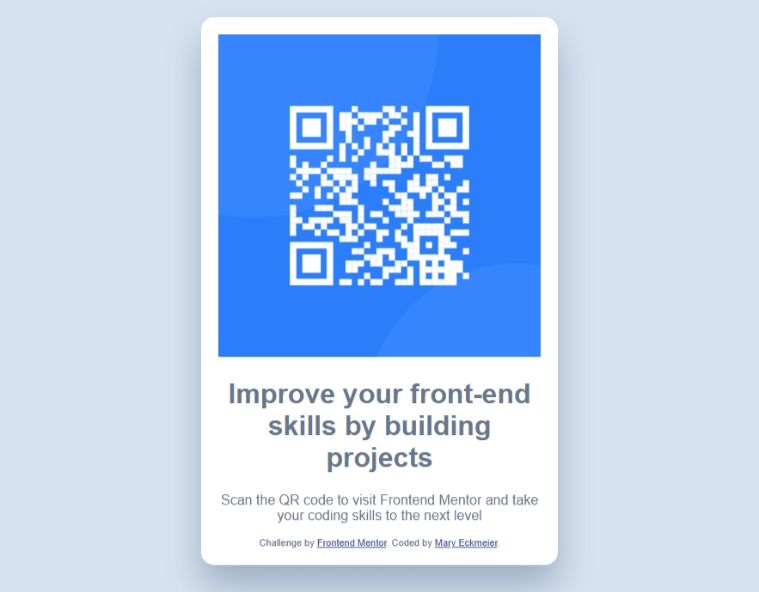

# Frontend Mentor - QR code component solution

This is a solution to the [QR code component challenge on Frontend Mentor](https://www.frontendmentor.io/challenges/qr-code-component-iux_sIO_H). Frontend Mentor challenges help you improve your coding skills by building realistic projects. 

## Table of contents

- [Overview](#overview)
  - [Screenshot](#screenshot)
  - [Links](#links)
- [My process](#my-process)
  - [Built with](#built-with)
  - [What I learned](#what-i-learned)
  - [Continued development](#continued-development)
  - [Useful resources](#useful-resources)
- [Author](#author)
- [Acknowledgments](#acknowledgments)

**Note: Delete this note and update the table of contents based on what sections you keep.**

## Overview

### Screenshot

### Links

- Solution URL: [Add solution URL here](https://github.com/meckmeier/qr-code-component-main)
- Live Site URL: [Add live site URL here](https://meckmeier.github.io/qr-code-component-main/)

## My process
Reviewed the brief, and then adjusted the HTML to include appropriate tags. 
Adding styles after the fact to control the look of the site.
I used VS GoLive to view the changes as I made them and worked thru each object until I thought it looked OK.

### Built with

- Semantic HTML5 markup
- CSS custom properties (embedded in the HTML)
- Mobile-first workflow

### What I learned
This project helped me work thru using GitHub to manage my project. I'm still a bit iffy on all the steps, but I think I got them to work.
I'm leveraging more and more the functionality in VS - including Emmet which really helped with a number of these components.

If you want more help with writing markdown, we'd recommend checking out [The Markdown Guide](https://www.markdownguide.org/) to learn more.

**Note: Delete this note and the content within this section and replace with your own learnings.**

### Continued development
I would like to review the https://www.markdownguide.org. I think there are a number of technologies I want to understand so I can become fluent in this space. I'm working on learning the basic of javascript as well. However, I was sidelined by the role of CSS after following a free course from Kevin Powell and it seems there are still a lot of things to learn about html and css before I revisit the JS component.

### Useful resources

I took the responsive layout course from Kevin Powell and found it powerfully useful. (https://courses.kevinpowell.co/)

## Author

- Website - [Mary Eckmeier]
- Frontend Mentor - [@meckmeier](https://www.frontendmentor.io/profile/meckmeier)

## Acknowledgments

Thanks again to Kevin Powell for the courses that have helped me gain some skills and the recommendation to come to frontendmentor for more practice and to Frontendmentor for providing this space.